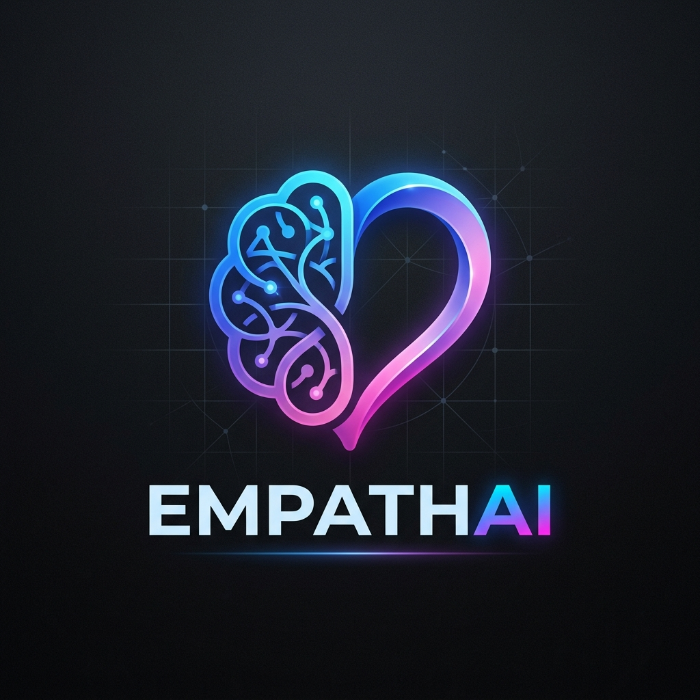
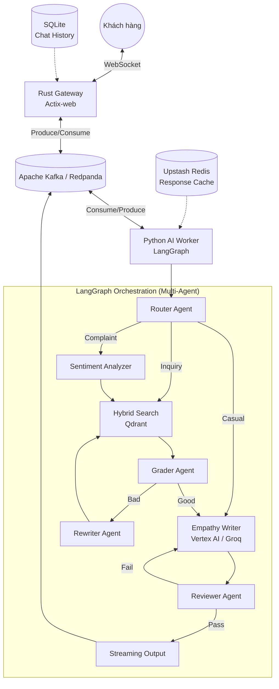

<div align="center">
  
  
# 🧠 EmpathAI

### Customer Service AI: Multi-Agent RAG + Fine-Tuning + Emotion Intelligence
  
  [](https://www.python.org/)
  [](https://www.rust-lang.org/)
  [](https://www.docker.com/)
  [](https://github.com/)

  **EmpathAI** là hệ thống AI Chăm sóc khách hàng (CSKH) tiếng Việt, chuyên giải quyết khiếu nại bằng sự **thấu cảm thực thụ** thay vì những câu trả lời rập khuôn.
</div>

---

## 📖 Tổng quan

Dự án là sự kết hợp giữa **Multi-Agent RAG (LangGraph)**, **Phân tích Cảm xúc (Sentiment Analysis)**, và **Supervised Fine-Tuning** (Vertex AI). Hệ thống không chỉ là một RAG Chatbot thông thường mà là một mạng lưới các Agents tự động phối hợp, đánh giá và sửa lỗi lẫn nhau.

### 🔄 Kiến trúc Hệ thống (System Architecture)



---

## 🏗️ Công nghệ cốt lõi (Tech Stack)

| Thành phần | Công nghệ | Vai trò |
|:--- |:--- |:--- |
| **I/O Gateway** | **Rust (Actix-web) + Tokio** | Xử lý WebSocket tốc độ cao, quản lý kết nối, lưu lịch sử chat (SQLite). |
| **Message Broker**| **Redpanda (Kafka)** | Điều tiết lưu lượng, chống quá tải (backpressure) giữa I/O và AI inference. |
| **Orchestration** | **LangGraph / Python** | Điều phối workflow phức tạp và Self-Reflective RAG qua các Agent chuyên biệt. |
| **LLM Backends** | **Vertex AI (Fine-tuned)** & **Groq** | Dual backend: Vertex AI (chính), Groq (phụ trợ cho Reviewer, Rewriter). |
| **Vector DB** | **Qdrant** | Hybrid Search (Dense + Sparse) kết hợp Reciprocal Rank Fusion (RRF). |
| **Reranker** | **bge-reranker-v2-m3** | Cross-encoder reranking để tăng độ chính xác của tài liệu thu hồi. |
| **Cache Layer** | **Upstash Redis** | Cache câu trả lời RAG để bypass LangGraph, giảm độ trễ (<50ms). |
| **Observability** | **Langfuse** | Tracing, giám sát token và thời gian phản hồi của từng bước (node). |

---

## ✨ Điểm nổi bật

- 🎭 **Empathy-First Learning**: Mô hình Llama-3.1-8B được fine-tune trên dữ liệu CSKH để phản hồi tự nhiên, thấu cảm, tránh văn phong robot.
- 🤖 **Multi-Agent Orchestration**: Hệ thống phân luồng (Router), tự đánh giá tài liệu (Grader), và kiểm duyệt chất lượng đầu ra (Reviewer) hoàn toàn tự động.
- 🔄 **Self-Reflective RAG**: Tự động viết lại câu truy vấn (Rewriter) và tìm kiếm lại nếu thông tin ban đầu không đạt yêu cầu.
- ⚡ **High Performance Backend**: Gateway viết bằng Rust Actix-web + Kafka giúp stream token mượt mà hàng ngàn kết nối cùng lúc mà không sập hệ thống.
- 📦 **So sánh 4 Kiến trúc**: Demo cung cấp 4 chế độ để chứng minh hiệu quả: (1) LLM base, (2) Fine-tuned LLM, (3) RAG + base LLM, (4) RAG + Fine-tuned LLM.

---

## ⚙️ Cấu hình Môi trường (.env)

Tạo file `.env` ở thư mục gốc của dự án và cấu hình theo mẫu sau:

```env
# 1. Groq API (Fallback & Fast LLM cho Reviewer/Rewriter)
GROQ_API_KEY=your_groq_api_key_here
GROQ_API_KEYS=key1,key2,key3 # Hỗ trợ round-robin nhiều key

# 2. Vertex AI (Fine-tuned LLM)
VERTEX_PROJECT_ID=your-gcp-project-id
VERTEX_REGION=asia-southeast1
VERTEX_ENDPOINT_ID=your-vertex-endpoint-id

# 3. Langfuse Observability (Tuỳ chọn)
LANGFUSE_SECRET_KEY=sk-lf-xxx
LANGFUSE_PUBLIC_KEY=pk-lf-xxx
LANGFUSE_HOST=https://cloud.langfuse.com

# 4. Redis Cache (Tuỳ chọn - Upstash)
UPSTASH_REDIS_REST_URL=https://xxx.upstash.io
UPSTASH_REDIS_REST_TOKEN=your_upstash_token

# 5. Cấu hình Model & Hệ thống
EMPATHY_MODE=vertex # "vertex" hoặc "groq"
EMBEDDING_MODEL=BAAI/bge-m3
RERANKER_MODEL=BAAI/bge-reranker-v2-m3
```

---

## 🚀 Hướng dẫn Chạy (Deployment)

### Bước 1: Khởi động Hạ tầng (Qdrant & Redpanda)

```bash
docker-compose up -d qdrant redpanda
```

### Bước 2: Chạy Python AI Worker (Background)

Bật terminal 1:
```bash
cd python
pip install -r requirements.txt
cd kafka_workers
python query_worker.py
```

### Bước 3: Chạy Rust Gateway (API & WebSocket)

Bật terminal 2:
```bash
cd rust_backend
cargo run
```
*Backend sẽ khởi chạy ở `http://localhost:8083` và WebSocket ở `ws://localhost:8083/ws/chat`*

### Bước 4: Chạy các Backend Demo Phụ (Để dùng tính năng So sánh 4 Model)

Bật terminal 3 (Chạy Req 1, 2, 3):
```bash
docker-compose up -d req1_llm_only req2_llm_finetune req3_llm_rag
```

---

## 💻 Tính năng Demo Web

Truy cập giao diện chính tại: **`http://localhost:8083`**

### 1. Chế độ Chat đơn (Single Chat)
- Chọn model muốn chat (VD: "Req 4: EmpathAI (Fine-tuned + RAG)").
- Trải nghiệm tốc độ trả lời **streaming mượt mà** qua WebSocket.
- Hệ thống hỗ trợ **lưu lịch sử hội thoại** (được quản lý bởi Rust backend qua SQLite).

### 2. Chế độ So sánh 4 Model (Arena Mode)
- Ở thanh chọn góc trái, chọn **"So sánh cả 4"**.
- Nhập một câu khiếu nại (VD: "Hàng giao bị vỡ, làm ăn kiểu gì vậy!").
- Màn hình sẽ chia làm **Grid 2x2**, cho phép bạn xem song song tốc độ xử lý (ms) và nội dung phản hồi của:
  - **Req 1**: Base LLM (Không RAG)
  - **Req 2**: Fine-tuned LLM (Không RAG)
  - **Req 3**: Base LLM + RAG
  - **Req 4**: Fine-tuned LLM + RAG (Kiến trúc cuối cùng)

---

## 📁 Cấu trúc Thư mục (Directory Structure)

```text
vibe coding/
├── frontend/               # Giao diện Web (HTML, JS thuần, TailwindCSS)
├── rust_backend/           # Actix-web Gateway: Xử lý WebSocket, REST API, SQLite
├── python/                 # Core AI (LangGraph, Kafka Worker, Vector Search)
│   ├── agents/             # Định nghĩa các node trong LangGraph (Router, Grader, v.v.)
│   ├── kafka_workers/      # Consumer lắng nghe tin nhắn từ Rust
│   ├── retrieval/          # Hybrid Search (Qdrant), Reranker, Redis Cache
│   └── data_processing/    # Xử lý văn bản, tạo index embedding
├── req1_llm_only/          # (Demo) FastAPI server chạy base LLM
├── req2_llm_finetune/      # (Demo) FastAPI server chạy fine-tuned LLM
├── req3_llm_rag/           # (Demo) FastAPI server chạy base LLM + RAG
├── evaluation/             # Script Python để benchmark 4 cấu trúc
├── data/                   # Dữ liệu chính sách CSKH (JSON, Text)
├── docker-compose.yml      # File deploy Qdrant, Redpanda và các req1-2-3
└── .env                    # File biến môi trường
```

---

## 📈 Giám sát (Monitoring) với Langfuse

Mọi truy vấn đi qua hệ thống (Req 4) đều được tự động log lên **Langfuse Dashboard** (nếu đã cấu hình `.env`). Bạn có thể theo dõi:
- **Traces**: Xem toàn bộ workflow của LangGraph từ đầu đến cuối.
- **Latency**: Thời gian xử lý của từng Agent (Router tốn bao lâu, LLM inference mất bao nhiêu ms).
- **Token Usage**: Chi phí token của Vertex AI và Groq.
- **Generation**: Xem rõ Prompt hệ thống sinh ra và Response trả về.

---

<div align="center">
  <sub>Built with ❤️ by Hoàng Xuân Thành. Powered by Rust, Python, Vertex AI & Llama 3.1.</sub>
</div>
