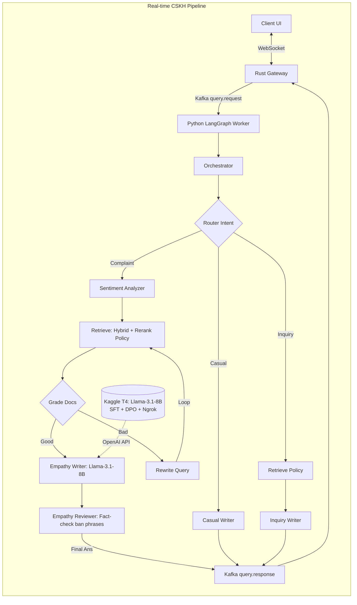

# 🧠 EmpathAI: Customer Service AI (RAG + Fine-Tuning + Emotion Intelligence)

Hệ thống AI Chăm sóc khách hàng (CSKH) tiếng Việt, đặc biệt chuyên giải quyết khiếu nại bằng sự thấu cảm (Empathy) thay vì văn mẫu.

Dự án này là sự kết hợp sâu giữa **Agentic RAG (LangGraph)**, **Sentiment Analysis**, và **Supervised Fine-Tuning (SFT) + DPO** trên nền tảng **Kaggle** để biến một mô hình ngôn ngữ thô thành một trợ lý CSKH tận tâm.

```
Vietnamese Complaint → [Rust Gateway] → [Kafka] → [LangGraph Pipeline] 
     ↓
[Sentiment = Toxic/Frustrated]
     ↓
[Hybrid Search: Policy DB] 
     ↓
[Fine-tuned Llama-3.1-8B via Kaggle Ngrok] → Streaming Empathetic Response
```

## 🏗️ Architecture (v1.0)

Hệ thống sử dụng mô hình vi dịch vụ phân tán kết hợp Cloud/Local Inference:

1. **API Gateway (Rust):** Quản lý kết nối WebSocket, lưu trữ lịch sử chat (`Rusqlite`), và giám sát I/O.
2. **Message Broker (Redpanda/Kafka):** Xương sống trung chuyển dữ liệu đa luồng.
3. **AI Pipeline (Python):** Mạng lưới Đồ thị (LangGraph) xử lý quy trình: Nhận diện Cảm xúc → Tìm chính sách → Sinh phản hồi → Đánh giá thấu cảm.
4. **Cloud Inference (Kaggle):** Mô hình Llama-3.1-8B được fine-tune bằng Unsloth (SFT + DPO) trên Kaggle, và mở API Server qua **FastAPI + Ngrok** để backend gọi trực tiếp.



### Điểm nổi bật

1. **Dữ liệu mồi linh hoạt (Synthetic Data):** Tạo bộ dữ liệu SFT và DPO (>1000 cặp) hoàn toàn tự động bằng Groq từ các mẫu khiếu nại cơ bản, dạy AI phân biệt giữa văn biểu cảm thật sự (Chosen) và văn mẫu robot (Rejected).
2. **Kaggle Serverless Inference:** Fine-tune model trực tiếp trên Kaggle T4 GPU bằng thư viện Unsloth, sau đó dùng FastAPI và Ngrok để mở cổng API biến Notebook Kaggle thành một Inference Server miễn phí và mạnh mẽ.
3. **Phân loại Cảm Xúc (Embedding-based):** Sử dụng các cụm vector cảm xúc (toxic, disappointed, frustrated, neutral) tính toán bằng Cosine Similarity siêu nhẹ thay vì tốn token gọi LLM.
4. **Empathy Quality Checker:** Agent reviewer độc lập check lại output xem AI có lỡ miệng dùng các từ cấm (Vui lòng chờ, theo chính sách, xin lỗi vì sự bất tiện) hay không trước khi gửi cho khách.

## 🧩 Tech Stack

| Component | Technology |
|-----------|-----------|
| **Frontend UI** | HTML5, Tailwind CSS, Empathy Mode Theme |
| **API Gateway / WebSocket** | Rust (Actix-Web, actix-ws) |
| **Message Broker** | Redpanda (Kafka-compatible) |
| **Indexing / Retrieval** | LlamaIndex (Qdrant Vector Store) |
| **Agent Orchestration** | LangGraph + LangChain Core |
| **Vector DB** | Qdrant (Dense + Sparse Hybrid Search) |
| **Cloud LLM (Generation)** | Tự host: Kaggle (Llama-3.1-8B-bnb-4bit) + Ngrok |
| **Fine-Tuning Stack** | Unsloth, TRL, PEFT, Huggingface Datasets |
| **Fallback LLM** | Groq API (LLaMA-3.3-70b) |

## 🚀 Huấn luyện & Data Generation

Trước khi chạy backend, bạn cần có Model đã Fine-tune.

1. Chạy gen dữ liệu SFT/DPO:
```bash
python python/data_processing/synthetic_generator.py
python python/data_processing/prepare_finetune_data.py
```

2. Tải file `dataset_sft.json` và `dataset_dpo.json` lên Kaggle.
3. Chạy Notebook `kaggle/empathAI_finetune.py` trên Kaggle.
4. Lúc cuối Notebook, Kaggle sẽ cấp cho bạn 1 đường link **Ngrok** (VD: `https://xxx.ngrok-free.app`). 
5. Copy link Ngrok dán vào file `.env` ở repo backend:
```env
KAGGLE_INFERENCE_URL=https://xxx.ngrok-free.app/v1
```

## 🚀 Quick Start (Chạy RAG Backend)

### 1. Khởi động Hạ Tầng Docker & Nạp chính sách

```bash
docker-compose up -d
cd python && pip install -r requirements.txt

# Khởi tạo Kafka Topics
python python/kafka_workers/kafka_config.py

# Nạp Policy lên CSDL Qdrant RAG
python python/data_processing/policy_loader.py --recreate
```

### 2. Khởi động Ngữ Cảnh Backend (3 Terminal Rust & Python)

```bash
# Terminal 1: Rust API Server
cd backend && cargo run

# Terminal 2: Query Worker (LangGraph Agent)
python python/kafka_workers/query_worker.py

# Terminal 3: UI Frontend Server
cd frontend && python -m http.server 3000
```

Truy cập: [http://localhost:3000](http://localhost:3000) và bắt đầu thử nghiệm khiếu nại (VD: "Giao hàng trễ quá, gọi lên tổng đài không ai thèm nghe máy!!")
