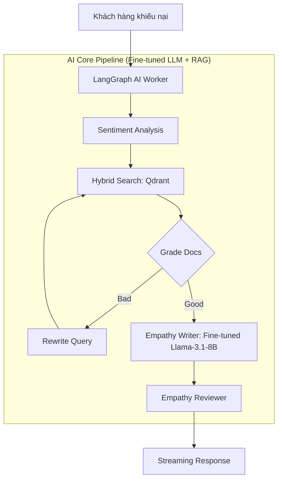

<div align="center">
  
  
  # 🧠 EmpathAI

  ### Customer Service AI: RAG + Fine-Tuning + Emotion Intelligence
  
  [](https://www.python.org/)
  [](https://www.docker.com/)
  [](https://github.com/)

  **EmpathAI** là hệ thống AI Chăm sóc khách hàng (CSKH) tiếng Việt, chuyên giải quyết khiếu nại bằng sự **thấu cảm thực thụ** thay vì những câu trả lời rập khuôn.
</div>

---

## 📖 Tổng quan
Dự án là sự kết hợp giữa **Agentic RAG (LangGraph)**, **Phân tích Cảm xúc (Sentiment Analysis)**, và **Supervised Fine-Tuning** trên **Vertex AI / HuggingFace**. Chúng tôi biến một mô hình ngôn ngữ thành một trợ lý CSKH tận tâm, biết lắng nghe và phản hồi bằng ngôn từ xoa dịu.

### 🔄 Luồng xử lý chính (Yêu cầu 4)



---

## 🏗️ Kiến trúc & Công nghệ

| Thành phần | Công nghệ | Vai trò |
|:--- |:--- |:--- |
| **Agentic RAG** | **LangGraph / Python** | Điều phối workflow phức tạp và Self-Reflective RAG. |
| **LLM Backends** | **Vertex AI Custom Endpoint**, **Groq** | Fine-tuned Llama-3.1-8B và fallback base model. |
| **Vector DB** | **Qdrant** | Hybrid Search (Dense + Sparse) với RRF fusion. |
| **Reranker** | **BGE-Reranker-v2-M3** | Cross-encoder reranking để tăng độ chính xác. |
| **Observability** | **Langfuse** | Tracing, giám sát và đánh giá chất lượng hội thoại. |
| **Infrastructure** | **Docker** | Dễ dàng triển khai Qdrant và các dịch vụ phụ trợ. |

---

## ✨ Điểm nổi bật

- 🎭 **Empathy-First Learning**: Fine-tuned trên dữ liệu CSKH MyKingdom giúp AI phân biệt văn phong thấu cảm và văn mẫu máy móc.
- 🔍 **Hybrid & Self-Reflective RAG**: Kết hợp Dense + Sparse search trên Qdrant, tự động sửa truy vấn (Rewriter) nếu thông tin không đạt yêu cầu.
- 🛡️ **Empathy Quality Checker**: Agent độc lập kiểm duyệt lần cuối để đảm bảo AI không dùng từ ngữ "robot".
- 📦 **4 Yêu cầu rõ ràng**: Cung cấp 4 kiến trúc khác nhau để so sánh hiệu quả: LLM only, Fine-tuned only, RAG only, và Fine-tuned + RAG.

---

## 🚀 Hướng dẫn cài đặt

### 1. Chuẩn bị Hạ tầng

```bash
# Khởi động Qdrant (vector database)
docker-compose up -d qdrant

# Cài đặt thư viện Python
cd python && pip install -r requirements.txt
```

### 2. Cấu hình Environment

Sao chép và chỉnh sửa file `.env`:
```bash
# Vertex AI (fine-tuned model)
VERTEX_PROJECT_ID=your-project-id
VERTEX_REGION=asia-southeast1
VERTEX_ENDPOINT_ID=your-endpoint-id

# Groq (fallback)
GROQ_API_KEY=your-groq-key

# Chế độ backend: "vertex" hoặc "groq"
EMPATHY_MODE=vertex
```

### 3. Nạp dữ liệu chính sách
```bash
# Index tài liệu lên Qdrant
python python/data_processing/indexer.py
```

### 4. Chạy các yêu cầu

```bash
# Yêu cầu 1: LLM only
cd req1_llm_only && python chatbot.py

# Yêu cầu 2: Fine-tuned only
cd req2_llm_finetune && python chatbot.py

# Yêu cầu 3: RAG only
cd req3_llm_rag && python chatbot.py

# Yêu cầu 4: Fine-tuned + RAG (kiến trúc đầy đủ)
cd python && python agents/graph.py
```

---

## 📈 Giám sát (Monitoring)

Hệ thống tích hợp **Langfuse** để theo dõi từng bước suy nghĩ của AI:
- Xem chi tiết Retrieval docs.
- Theo dõi độ trễ (Latency) và chi phí (Tokens).
- Đánh giá Feedback của khách hàng trên Dashboard.

## 📁 Cấu trúc thư mục

```
vibe coding/
├── python/                 # Yêu cầu 4: Fine-tuned + RAG (kiến trúc đầy đủ)
├── req1_llm_only/          # Yêu cầu 1: LLM only
├── req2_llm_finetune/      # Yêu cầu 2: Fine-tuned only
├── req3_llm_rag/           # Yêu cầu 3: RAG only
├── data/
│   └── mykingdom_policies.json
├── docker-compose.yml
└── .env
```

---

<div align="center">
  <sub>Built with ❤️ by the EmpathAI Team. Powered by Python, Vertex AI & Llama 3.1.</sub>
</div>
