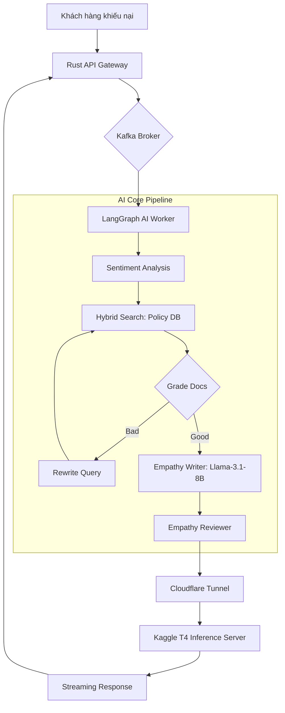

<div align="center">
  
  
  # 🧠 EmpathAI

  ### Customer Service AI: RAG + Fine-Tuning + Emotion Intelligence
  
  [](https://www.python.org/)
  [](https://www.rust-lang.org/)
  [](https://www.docker.com/)
  [](https://github.com/)

  **EmpathAI** là hệ thống AI Chăm sóc khách hàng (CSKH) tiếng Việt thế hệ mới, chuyên giải quyết khiếu nại bằng sự **thấu cảm thực thụ** thay vì những câu trả lời rập khuôn.
</div>

---

## 📖 Tổng quan
Dự án là sự kết hợp tinh tế giữa **Agentic RAG (LangGraph)**, **Phân tích Cảm xúc (Sentiment Analysis)**, và **Supervised Fine-Tuning (SFT) + DPO** trên nền tảng **Kaggle**. Chúng tôi biến một mô hình ngôn ngữ thô thành một trợ lý CSKH tận tâm, biết lắng nghe và phản hồi bằng ngôn từ xoa dịu.

### 🔄 Luồng xử lý chính



---

## 🏗️ Kiến trúc & Công nghệ (v1.5)

Hệ thống sử dụng mô hình vi dịch vụ phân tán, tối ưu hóa cho hiệu năng và khả năng mở rộng:

| Thành phần | Công nghệ | Vai trò |
|:--- |:--- |:--- |
| **Frontend UI** | HTML5 / Vanilla CSS / JS | Giao diện Chat chế độ "Empathy" tối giản. |
| **API Gateway** | **Rust (Actix-Web)** | Xử lý WebSocket, lưu trữ lịch sử (`sqlite`), hiệu năng cực cao. |
| **Message Broker** | **Redpanda (Kafka)** | Xương sống truyền tin đa luồng giữa Rust và Python. |
| **Agentic RAG** | **LangGraph / Python** | Điều phối workflow phức tạp và cơ chế Self-Reflective RAG. |
| **Observability** | **Langfuse** | Tracing, giám sát và đánh giá chất lượng hội thoại thời gian thực. |
| **Infrastructure** | **Cloudflare Tunnel** | Cầu nối bảo mật từ Kaggle Inference về Local Server. |
| **Database** | **Qdrant + Upstash** | Vector DB cho RAG và Redis để Cache kết quả. |

---

## ✨ Điểm nổi bật

- 🚀 **Kaggle Cloud Inference**: Host Llama-3.1-8B miễn phí nhưng mạnh mẽ trên Kaggle T4, truy cập qua Cloudflare Tunnel không cần mở port.
- 🎭 **Empathy-First Learning**: Fine-tuned bằng kỹ thuật DPO giúp AI phân biệt được văn phong thấu cảm (Chosen) và văn mẫu máy móc (Rejected).
- 🔍 **Hybrid & Self-Reflective RAG**: Kết hợp Dense + Sparse search trên Qdrant, tự động sửa truy vấn (Rewriter) nếu thông tin tìm thấy không đạt yêu cầu.
- 🛡️ **Empathy Quality Checker**: Một Agent độc lập sẽ kiểm duyệt lần cuối để đảm bảo AI không dùng các từ ngữ "robot" (vd: "xin lỗi vì sự bất tiện").

---

## 🚀 Hướng dẫn cài đặt


### 1. Chuẩn bị Hạ tầng (Docker)

```bash
# Khởi động Qdrant và Redpanda (Kafka)
docker-compose up -d

# Cài đặt thư viện Python
cd python && pip install -r requirements.txt
```

### 2. Thiết lập Kaggle Inference

1. Chạy Notebook `kaggle/empathAI_finetune.py` trên Kaggle.
2. Tại máy local, khởi động Cloudflare Tunnel để bắt link từ Kaggle (nếu dùng cloudflared).
3. Cập nhật file `.env` với link Cloudflare nhận được:
   ```env
   KAGGLE_INFERENCE_URL=https://your-tunnel-id.trycloudflare.com/v1
   ```

### 3. Nạp dữ liệu chính sách
```bash
# Khởi tạo Kafka Topics
python python/kafka_workers/kafka_config.py

# Nạp Policy lên CSDL Qdrant
python python/data_processing/policy_loader.py --recreate
```

### 4. Chạy hệ thống (3 Terminal)

```bash
# Terminal 1: Rust API Server
cd rust_backend && cargo run

# Terminal 2: LangGraph Query Worker
python python/kafka_workers/query_worker.py

# Terminal 3: UI Frontend
cd frontend && python -m http.server 3000
```

---

## 📈 Giám sát (Monitoring)

Hệ thống tích hợp **Langfuse** để bạn có thể theo dõi từng bước suy nghĩ của AI:
- Xem chi tiết Retrival docs.
- Theo dõi độ trễ (Latency) và chi phí (Tokens).
- Đánh giá Feedback của khách hàng trực tiếp trên Dashboard.

---

<div align="center">
  <sub>Built with ❤️ by the EmpathAI Team. Powered by Rust, Python & Llama 3.1.</sub>
</div>
